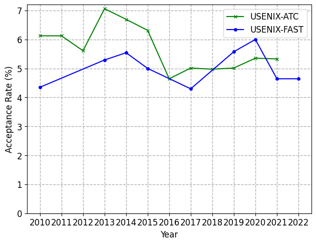

# Systems Conference Acceptance Rates

This repo contains the acceptance rates of the common systems conferences.
Information from the conferences are collected from wherever this information can be retrieved (typically this is a message from the Chairs). Information includes all submissions (short and long papers) and all accepted papers (also short and long papers).

## USENIX ATC



## Contribute

New data and more conferences are always welcome! Simply put in a PR with the new data files/folders.
**Only Requirement** is that the data is in the format

```
<Year> <# Submissions> <# Accepted>
```
