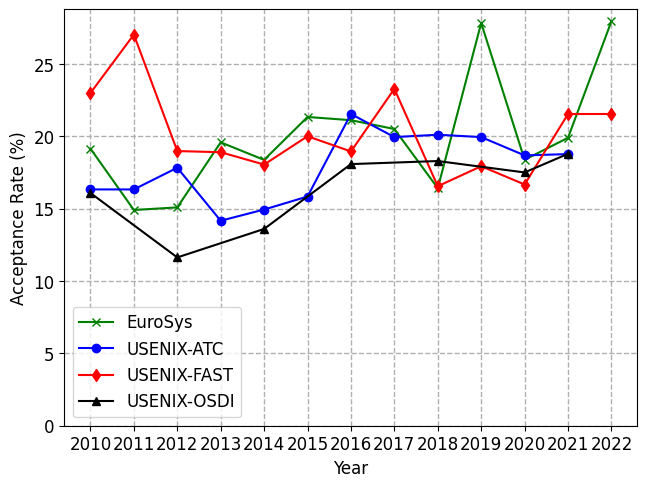

# Systems Conference Acceptance Rates

This repo contains the acceptance rates of the common systems conferences.
Information from the conferences are collected from wherever this information can be retrieved (typically this is a message from the Chairs). Information includes all submissions (short and long papers) and all accepted papers (also short and long papers).

## Storage Systems



## Plotting

Run the plotting script from the root dir with

```bash
python3 plot.py
```

It will generate a new plot for each of the directories in the `conferences/` directory, hence there conferences should be grouped by topic.

## Contribute

New data and more conferences are always welcome! Simply put in a PR with the new data files/folders.
**Only Requirement** is that the data is the correct directory and in the following format

```
<Year> <# Submissions> <# Accepted>
```

Feel free to add more conferences with their topic as the dir name and put in some data.
